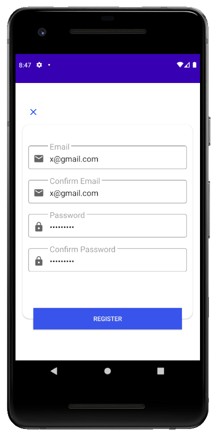
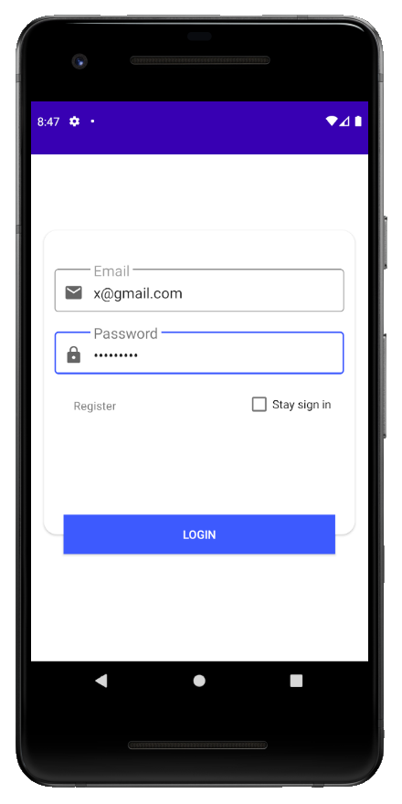
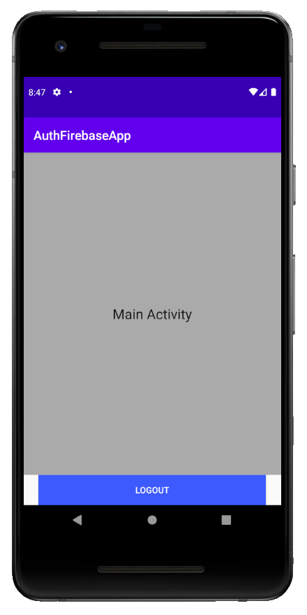
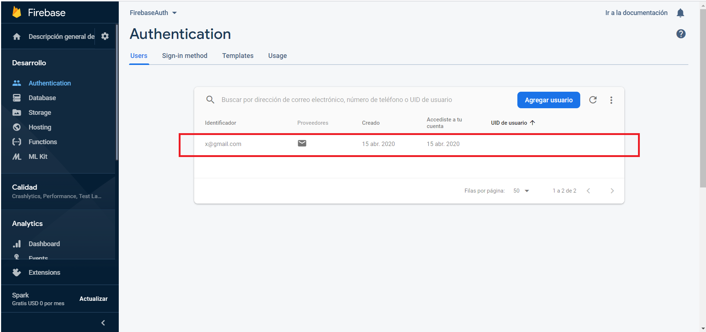

# FirebaseAuth
Firebase example (Authentication module) using multiple fragments (No architecture applied).
CardView, Animation, TextInputEditText, Activities/Fragments.

**Info:** https://firebase.google.com/

 -  
 

